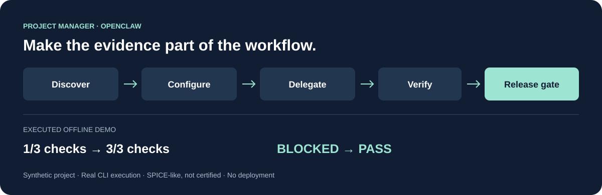

# Project Manager for OpenClaw

**Turn project intent into reviewed work, traceable evidence and a checked release.**

[](https://github.com/aminekhettat/engineering-project-manager/actions/workflows/checks.yml)
[](https://github.com/aminekhettat/engineering-project-manager/releases/latest)
[](LICENSE)

[Français](README.fr.md) · [Get started](docs/getting-started.md) · [Run the demo](examples/release-gate/README.md) · [Compatibility](docs/compatibility.md)

An engineering project management skill that helps your agent ask the right setup
questions, delegate bounded tasks and keep requirements, changes, baselines,
verification evidence, risks and milestones consistent. Deterministic Python
commands check the records that support a release decision.



**SPICE-like, not certified.** Independent software; no SPICE/Automotive SPICE
certification, standards-body endorsement or conformity assessment. A passing
gate does not establish compliance or a capability level. [Scope and limits](skills/project-manager/docs/SPICE-SCOPE.md).

## Install

Runtime: **Linux, Python 3.10+ and Git**. No Python packages required.
Run in your OpenClaw workspace (Node.js 22.20+ / npm is needed for this installer):

```sh
npx skills@1.6.0 add aminekhettat/engineering-project-manager --skill project-manager -a openclaw --copy
```

Review the installer destination before confirming. Or download the runtime ZIP
and SHA-256 file from [Releases](https://github.com/aminekhettat/engineering-project-manager/releases/latest),
verify the hash and extract `project-manager/` into your configured skills directory.
Start a new agent session. See [installation and first project](docs/getting-started.md)
for paths, updates and the source-checkout option.

## Try it with your agent

**Start a project**

> Use project-manager. Discover whether this project already exists, then ask me
> the missing questions about scope, disciplines, repository, infrastructure,
> team, delegation and delivery. Show the resolved setup before creating resources.

**Recover an existing project**

> Use project-manager to assess this repository without changing its records.
> Show the current status, missing evidence, blockers and a prioritized next step.

**Prepare a release**

> Use project-manager to review this candidate. Check exact requirement revisions,
> verification evidence, risks, problems and milestones. Explain every release
> blocker; never invent acceptance or proof to make a check pass.

## See a real blocked-to-ready example

From a full repository checkout on Linux:

```sh
python3 tools/demo_project.py --output /tmp/pm-demo
```

Use a destination that does not exist. The offline demo executes a defective toy
program, observes **1/3 checks passing**, then corrects it and observes **3/3**.
The full project gate moves **BLOCKED → PASS** after the task, risk, problem,
milestone, exact-revision evidence and frozen candidate are resolved through the
actual CLIs. [Inspect the commands and captured output](examples/release-gate/README.md).
This is a synthetic demonstration, not a model benchmark or production assessment.

## What you get

| Need | How the skill helps |
| --- | --- |
| A correctly configured project | Guided questions, reviewed setup, GitHub/GitLab bootstrap and resumable recovery. |
| Accountable delegation | Capability discovery, bounded assignments, isolated work and reviewed returns. The planner prepares contracts; the agent runtime dispatches them. |
| Controlled engineering changes | Stable requirement identities, exact revisions, impact analysis and immutable frozen baselines. |
| Evidence for delivery | Verification records tied to exact revisions, artifact hashes and a composite release gate. |
| Visible blockers | Managed risks, problems, milestones, external sources and obligation coverage. |
| Work across disciplines | Tailored references for systems, software, hardware, ML, mechanical and cybersecurity work. |

Human engineering review, permission to act, risk acceptance and real-world
verification remain necessary. [Implemented capabilities and limits](skills/project-manager/docs/INDUSTRIALIZATION-ROADMAP.md).

## Explore and contribute

- [How the repository is organized](docs/architecture.md) — one self-contained runtime, separate contributor tools.
- [Compatibility and integrations](docs/compatibility.md) — tested runtime versus format compatibility.
- [Positioning and related projects](docs/comparison.md) — engineering control versus product discovery and generic planning.
- [Agent evaluation scenarios](examples/agent-evaluation.md) — reproducible exercises, with no unmeasured success claims.
- [Contributing](CONTRIBUTING.md), [changelog](CHANGELOG.md), [security](SECURITY.md) and [publication](docs/PUBLICATION.md).
- [Report a reproducible bug](https://github.com/aminekhettat/engineering-project-manager/issues/new/choose) or [discuss a use case](https://github.com/aminekhettat/engineering-project-manager/discussions).

GitHub source and release archives use [MIT](LICENSE). A separately generated
ClawHub distribution uses MIT-0 under that registry's rules; see its packaged
license. Third-party standards retain their own terms. If this helps your work,
share a sanitized example or contribute a reproducible improvement.
